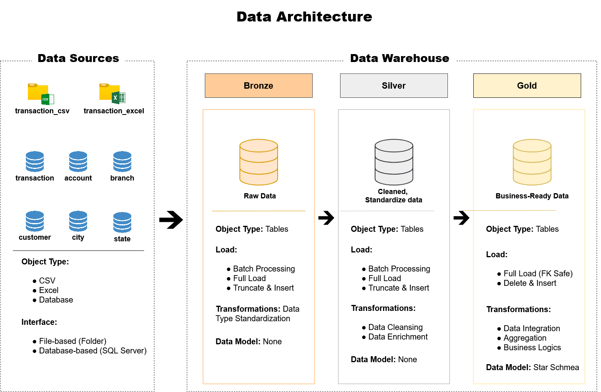
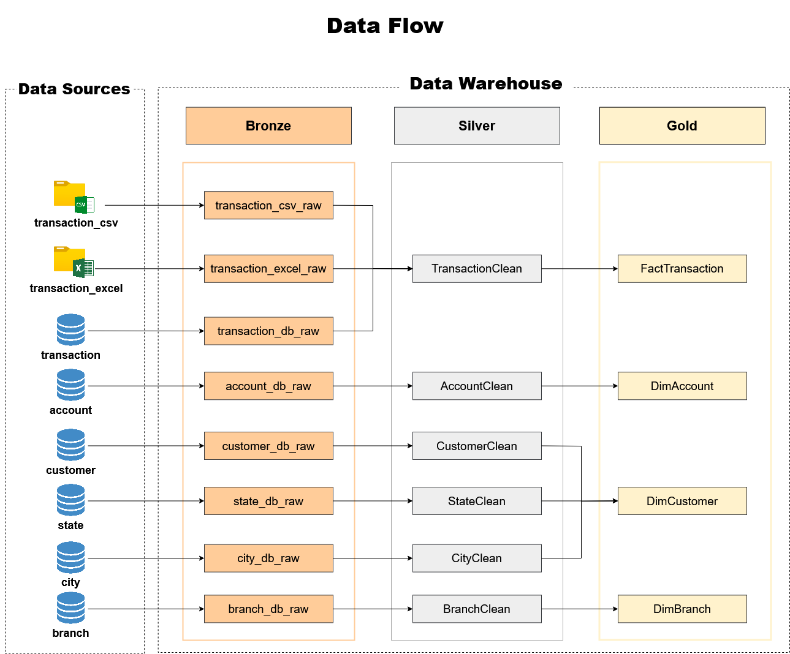

# Data Warehouse Project
  
One of the clients of ID/X Partners, operating in the banking industry, required the development of a Data Warehouse to integrate multiple data sources stored within their internal systems. The client manages data originating from several many sources including Excel files, CSV documents, and Databases. The primary challenge faced by the client is the inability to extract and consolidate data from multiple sources simultaneously. This limitation leads to delayed reporting cycles and obstructs timely data analysis, which is critical for operations and decision-making within the banking environment.

This project focuses on building a robust Data Warehouse solution using the Medallion Architecture (Bronze, Silver, Gold layers). Additionally, the project implements stored procedures to generate Daily Transactions and Customer Balance outputs.

---
## 🛠️ Data Architecture

1. **Bronze Layer**: Stores raw data as-is from the source systems. Data is ingested from CSV, Excel, and Databases into SQL Server Database. In this layer light transformations are applied, including data type standardization, to ensure consistent data formats before the data is processed in the silver layers.

2. **Silver Layer**: This layer includes data cleansing and data enrichment processes to prepare data for analysis. Data cleansing activities typically involve removing duplicates, standardizing column values such as converting them to uppercase, and applying sorting rules to organize the dataset. Data enrichment focuses on combining and integrating related transactional data into a unified and well-structured dataset, enabling more meaningful analysis in the subsequent layer.

3. **Gold Layer**: Houses business-ready data modeled into a [Star Schema](docs/ERD_StarSchema.png) required for reporting and analytics. 

## 🛠️ Data Flow

---

